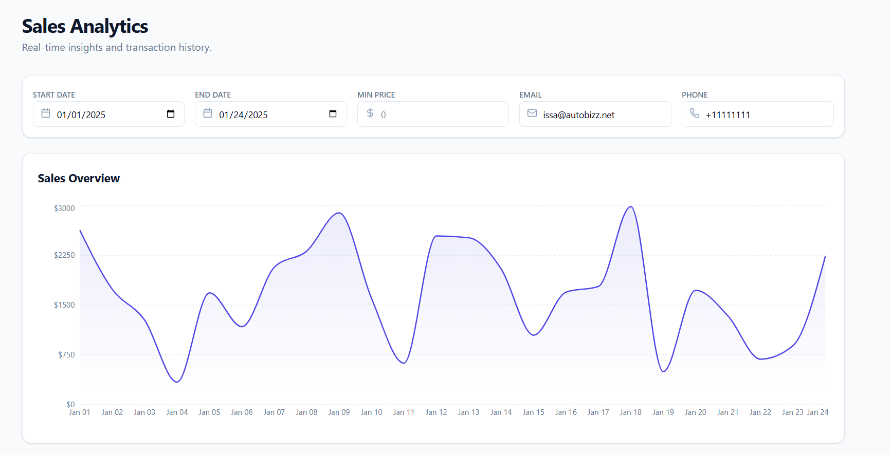

<p align="center">
  
</p>

<h1 align="center">📊 Sales Analytics Dashboard</h1>
<p align="center">A clean, high-performance dashboard for visualizing and exploring sales data with cursor-based pagination.</p>

<br/>

---

<h2>📌 Table of Contents</h2>

- <a href="#overview">Overview</a>
- <a href="#features">Key Features</a>
- <a href="#tech">Tech Stack</a>
- <a href="#architecture">Architecture & Decisions</a>
- <a href="#getting-started">Getting Started</a>
- <a href="#structure">Project Structure</a>
- <a href="#optimizations">Performance Optimizations</a>

---

<h2 id="overview">🔎 Overview</h2>

This dashboard interacts with a Sales API to authenticate users, fetch transaction data, apply real-time filters, and visualize sales trends over time.

The main challenge of this build was handling **Cursor-Based Pagination (before/after tokens)** and crafting a smooth Next/Previous navigation experience without re-fetching stale data.

<br/>

---

<h2 id="features">✨ Key Features</h2>

<h3>1. 🔍 Advanced Filtering</h3>
<ul>
  <li>Date filtering with Start and End range</li>
  <li>Minimum price search</li>
  <li>Email and Phone filtering</li>
  <li>Instant data refresh on filter updates</li>
</ul>

<h3>2. 📈 Data Visualization</h3>
<ul>
  <li>Interactive time-series Area Chart (Recharts)</li>
  <li>Responsive design across all screen sizes</li>
</ul>

<h3>3. ⚡ Smart Pagination</h3>
<ul>
  <li>Before/After cursor-based API navigation</li>
  <li>History Stack to solve the Previous Page problem</li>
  <li>No stale data or repeated requests</li>
</ul>

<h3>4. 📊 Interactive Data Table</h3>
<ul>
  <li>Server-side sorting (Date + Price)</li>
  <li>Loading skeletons for smooth UX</li>
</ul>

<h3>5. 💾 Caching & State Management</h3>
<ul>
  <li>React Query for server state management</li>
  <li>Instant back navigation using caching</li>
</ul>

<br/>

---

<h2 id="tech">🛠 Tech Stack</h2>

<table>
  <tr>
    <th>Category</th>
    <th>Technology</th>
    <th>Purpose</th>
  </tr>
  <tr>
    <td>Framework</td>
    <td>Next.js 14</td>
    <td>App structure & routing</td>
  </tr>
  <tr>
    <td>Styling</td>
    <td>Tailwind CSS</td>
    <td>Responsive UI design</td>
  </tr>
  <tr>
    <td>State / Async</td>
    <td>React Query</td>
    <td>Data fetching, caching</td>
  </tr>
  <tr>
    <td>Charting</td>
    <td>Recharts</td>
    <td>Sales trend visualization</td>
  </tr>
  <tr>
    <td>Animation</td>
    <td>Framer Motion</td>
    <td>Visual transitions</td>
  </tr>
  <tr>
    <td>Icons</td>
    <td>Lucide React</td>
    <td>Clean SVG icons</td>
  </tr>
</table>

<br/>

---

<h2 id="architecture">🧠 Architecture & Decisions</h2>

<h3>Why React Query?</h3>
<ul>
  <li>Prevents duplicate requests</li>
  <li>Caches each page for instant back navigation</li>
  <li>Provides isLoading / isFetching for better UX</li>
</ul>

<h3>Pagination Problem & Solution</h3>
<p>The Sales API uses before/after cursor-based pagination, which makes navigating backwards difficult.</p>

<p><strong>Solution:</strong></p>

<ul>
  <li>A <strong>Navigation History Stack</strong> stores previous cursors.</li>
  <li>Next → Push current cursor</li>
  <li>Previous → Pop cursor from history</li>
  <li>Ensures smooth and accurate page navigation</li>
</ul>

<br/>

---

<h2 id="getting-started">🚀 Getting Started</h2>

<h3>Prerequisites</h3>
<ul>
  <li>Node.js 18+</li>
  <li>npm or yarn</li>
</ul>

<h3>Installation Steps</h3>

git clone https://github.com/Umair505/Sales-Dashboard
cd sales-dashboard
npm install
npm run dev

yaml
Copy code

Open ➝ http://localhost:3000

<br/>

---

<h2 id="structure">📂 Project Structure</h2>

```txt
src/
├── app/
│   ├── layout.jsx           # Main layout with QueryProvider
│   └── page.jsx             # Dashboard: state + API logic
│
├── components/
│   ├── dashboard/
│   │   ├── FilterBar.jsx    # Filter input fields
│   │   ├── SalesChart.jsx   # Recharts Area Chart
│   │   └── SalesTable.jsx   # Table with sorting + pagination
│   └── providers/
│       └── QueryProvider.jsx # React Query client config
│
├── lib/
│   └── utils.js             # Helper utilities
<br/>
<h2 id="optimizations">⚙️ Performance Optimizations</h2> <ul> <li>Cursor-based navigation avoids heavy offset queries</li> <li>React Query caching eliminates unnecessary API calls</li> <li>Skeleton loaders improve perceived speed</li> <li>Charts and tables optimized for large datasets</li> </ul> <br/>
<h2 align="center">🚀 Live Demo</h2> <p align="center"> <a href="https://sales-dashboard-moinul.vercel.app">sales-dashboard-moinul.vercel.app</a> </p> <br/>
<p align="center">Developed by Moinul</p> ```